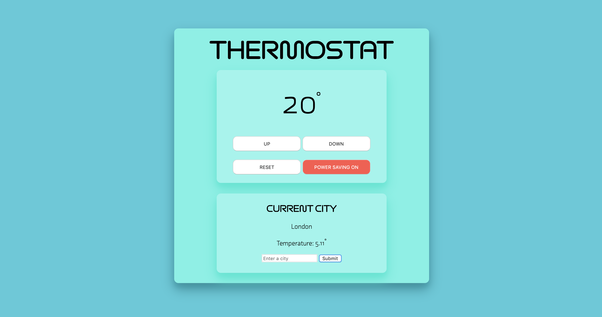
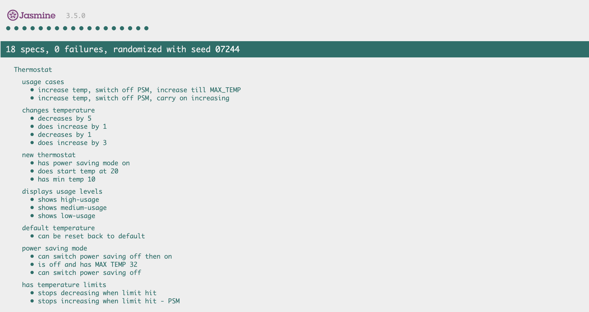

# Thermostat
 


Front-end only app to mimic the functionality of a thermostat.

Temperature is controlled by UP and DOWN buttons.

You can reset the temperature back to 20 degrees using the RESET button.

Power Saving Mode is toggled using the POWER SAVNG BUTTON.

You can find and display the temperature for a city by typing in a city and pressing Submit.

Display updates on any change made or button pressed.

***
## Design and build

This project was to gain experience working with JavaScript and manipulating a web page using jQuery.

Functionality of the thermostat was built in plain JavaScript and tested using the Jasmine testing framework.



Front-end interaction was handled by jQuery.

Weather data was pulled in using [OpenWeather](https://openweathermap.org/api) API.

Sass was used for stylesheet creation and compiled into CSS using terminal command ```sass --watch``` for continuous compiling on file saving.

My goal was to transfer skills learnt working and testing in ruby to a new language. The specifications were as follows for the build:

* Thermostat starts at 20 degrees.
* You can increase the temperature with an up function.
* You can decrease the temperature with a down function.
* The minimum temperature is 10 degrees.
* If power saving mode is on, the maximum temperature is 25 degrees.
* If power saving mode is off, the maximum temperature is 32 degrees.
* Power saving mode is on by default.
* You can reset the temperature to 20 with a reset function.
* Thermostat will show current energy usage: < 18 is low-usage, < 25 is medium-usage, anything else is high-usage. Shown using colours Green, Black and Red.


